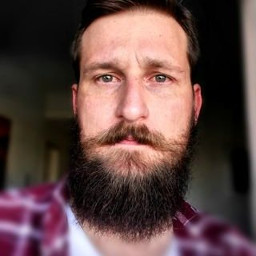
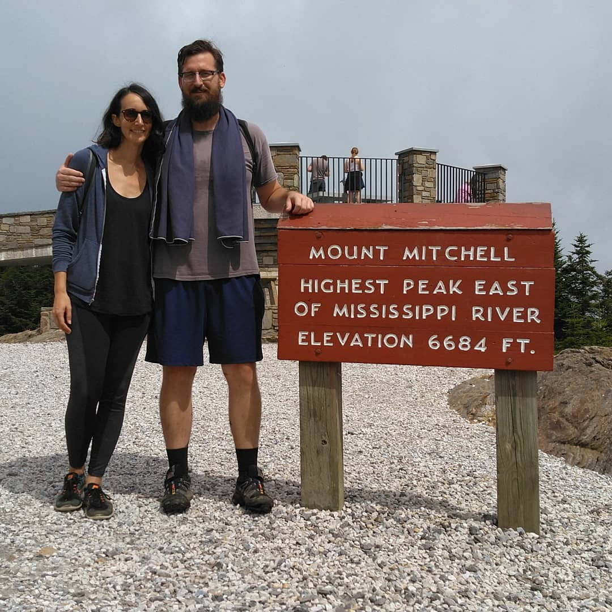

+++
title = 'About'
date = 2024-03-28T16:12:18-04:00
draft = false
custom_title_enabled = true
custom_title_value = 'About John'
+++

My full name is John Hunter Sheridan, and I was born and raised in a census-designated place called Dalzell, South Carolina (population 2,260). When I was younger, I thought this was lame. Now that I'm older and I've lived in quite a few large cities all across the world, I think it's the luckiest thing that ever happened to me.

I have about half of a computer science degree, and a bachelor's degree in Journalism and Mass Communications with a concentration in Visual Communications from the University of South Carolina. Despite this, I consider myself a programmer first and a designer second. I built my first website at about age 14 after my parents bought me "HTML 4 for Dummies" for Christmas. I did my first freelance work at 17, and had my first real programming job at 20. I'm now 36 years old, and I can't imagine doing anything else professionally, but I'd love to coach a basketball team on the side.

My partner, Briana, and I both work remotely and travel full-time. I've made an active choice to own very little, and that provides a level of freedom that outweighs any happiness I get out of material items. Eventually, I'd like to own land in Appalachia.

Outside of work and travel, my interests mostly revolve around free and open-source software, non-hierarchical forms of organizing businesses, and basketball.
