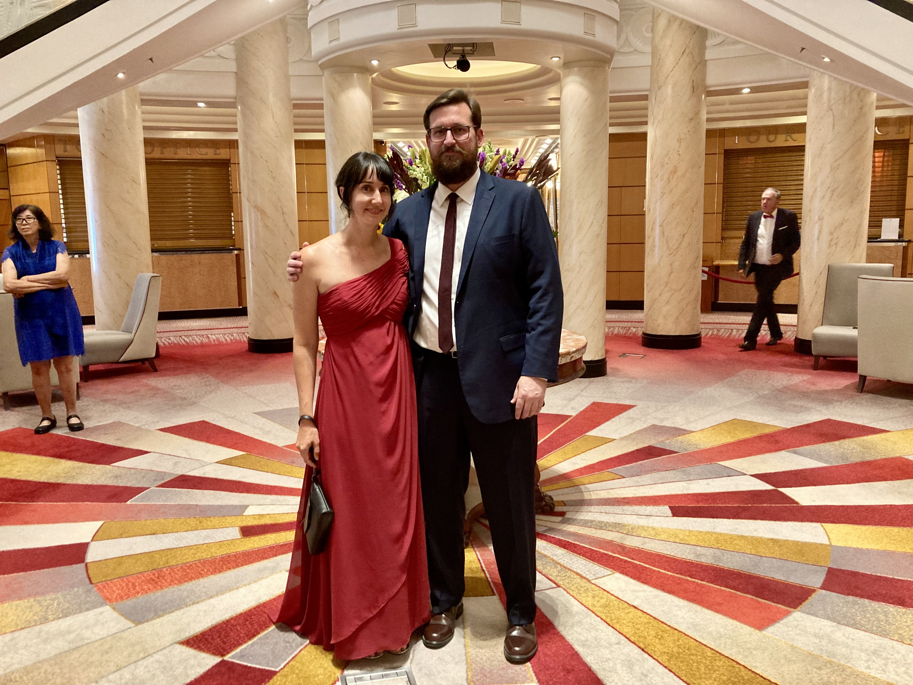
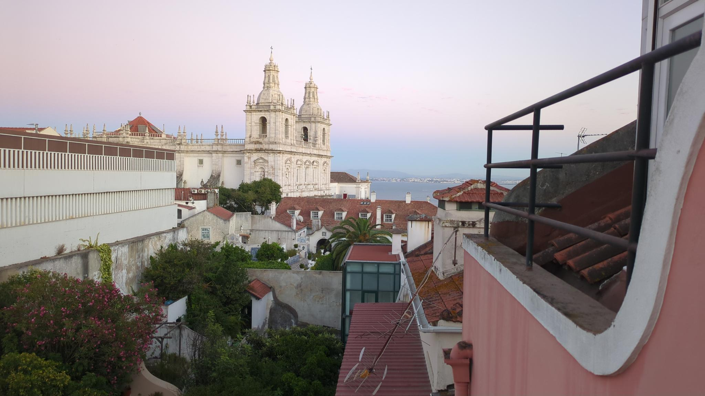

+++
title = 'Lisbon, Portugal'
date = 2025-08-29T06:41:12-04:00
draft = false
pinned = false
latitude = 38.7223
longitude = -9.1393
+++

# What I'm doing right now

  

    
Location 📌

    
Lisbon, Portugal

  

  
  

    
Timezone 🕓

    
European Summer Time

  

  
  

    
Last Updated ⌛

    
August 29th, 2025

  

  
  

## A quick visit to New York City

## Crossing the Atlantic by boat

On July 8th, we boarded the Queen Mary 2 for a 6 day journey across the Atlantic Ocean to Southampton, England.

Back porch views in Canton, NC

## We're in Lisbon for the summer

After 6 days at sea on the Queen Mary 2, and a very brief stop in London, Briana and I arrived in Lisbon for the summer.

Ut varius tincidunt libero. Curabitur turpis. Praesent vestibulum dapibus nibh. Proin sapien ipsum, porta a, auctor quis, euismod ut, mi. Sed mollis, eros et ultrices tempus, mauris ipsum aliquam libero, non adipiscing dolor urna a orci.

Back porch views in Canton, NC

