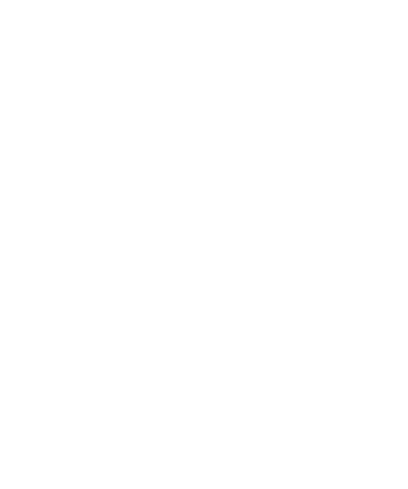
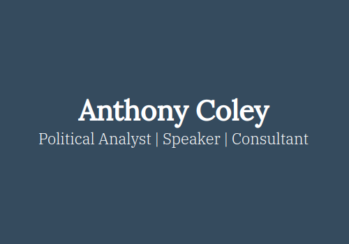
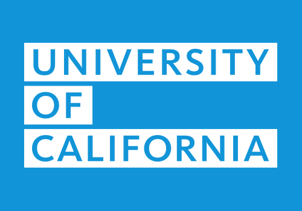
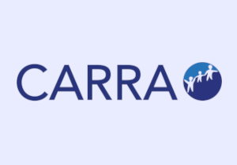
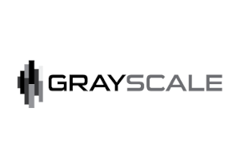
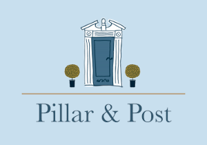
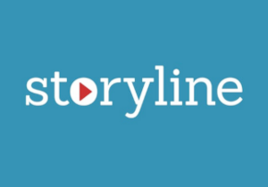
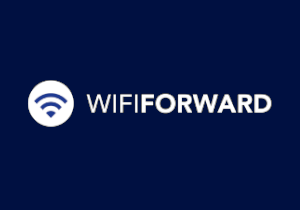

+++
title = 'Work'
date = 2024-03-28T16:12:18-04:00
draft = false
custom_title_enabled = true
custom_title_value = 'Programmer and Designer for Hire'
+++

  

    <a class="meta-button" href="#">Hire&nbsp;Me</a>
  

  

    
Experience

    
19 Years

  

  

    
Languages

    
PHP, Javascript, Python

  

  

    
Frameworks

    
Wordpress, JQuery

  

### Current Workload 😅

<progress value="90" max="100" style="--value: 90; --max: 100;"></progress>

If you're like most of my clients, you probably just figured out you need *something* on the internet, but you don't know exactly what it is yet. I'll help you figure that out, and then we'll build it together.

### What I can do for you

  

    
    <h1>Decisive Leadership</h1>
    
Sometimes you need someone to come in and take responsibility for your problems. Pass me the baton, and I'll run.

  

  

    
    <h1>Deliberate Strategy</h1>
    
Things don't happen by accident on the internet. We'll create a plan from first principles.

  

  

    
    <h1>Focused Design</h1>
    
Trends come and go, but design that solves problems is timeless.

  

  

    
    <h1>Clean Programming</h1>
    
Modern, standards-compliant code that is easy to expand and maintain. I use the latest tools and best practices to ensure your project is built to last.

  

<!-- Constructing a website requires deliberate strategy, focused design, and clean programming. I can bring a unique blend of these skill sets to your project.  -->

***I'm not a fly-by-night freelancer — I'm a sure-handed professional.***

I have nearly 20 years of experience helping people turn their ideas into websites and applications.

You can count on honesty, clear communication, and on-time results from me. If you want to get serious about your presence on the web, please get in touch.

<!-- <blockquote>
  
"I would recommend John for anyone trying to get the word out about their business. It has saved me so much time! In consectetuer turpis ut velit. Morbi mattis ullamcorper velit. Sed hendrerit. Ut leo. Integer tincidunt. Pellentesque auctor neque nec urna."

  <footer>- John Seng, <a href="#">Grayscale LLC</a></footer>
</blockquote> -->

### Here are some things I've worked on recently

<ul class="work-gallery">
  <li>
    
  </li>
  <li>
    
  </li>
  <li>
    
  </li>
  <li>
    
  </li>
  <li>
    
  </li>
  <li>
    
  </li>
  <li>
    
  </li>
  <li>
    
  </li>
</ul>

<!--
### Frequently Asked Questions

 #### So are you a designer or a programmer?
I'm both! And where I have limitations I've got an army of reliable friends I can call on to pick up the slack.

#### How much is this going to cost me?
Unfortunately the answer is... it depends. What do you want me to build for you? I cost a good bit more than your average freelancer. I cost a good bit less than your average agency and I move a lot faster.

#### Are you going to disappear like my last web guy?
Absolutely not. I'd say about half of my clients come to me as a result of a relationship with a Disappearing Web Guy™.

#### What's it like working with you?
I'm going to come in and immediately take responsibility for your problems. I'm a straight shooter, and I won't always tell you what you want to hear, but I'll always do what's best for you.

I'm the guy who is 5 minutes early to zoom meetings. I pick up the phone at 8:00pm on Friday.

I don't have a project manager. I don't have a sales guy. I send the invoices. I plan out projects. I do design work and I write code.I will take full responibility for the success of your project.
 -->

### Ready to start?

Here's how we begin: I'll send you a project questionnaire, we'll schedule a 30-minute call, then I'll send a proposal within 48 hours.

